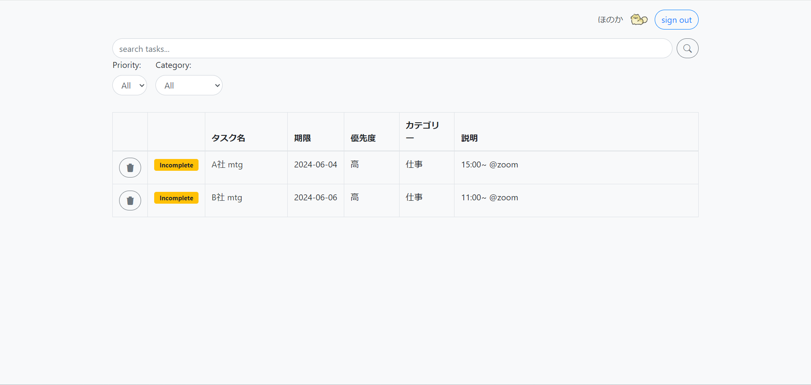
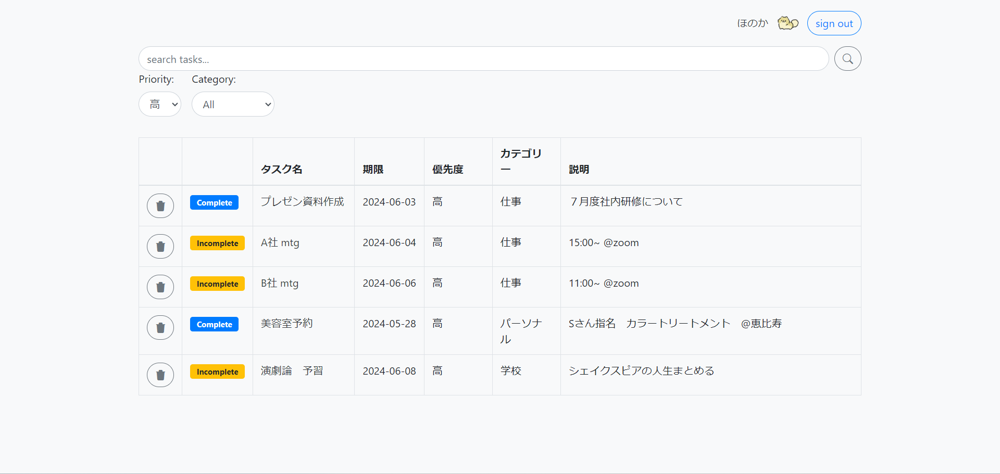

# TodoApp

## 概要
タスクを追加、削除、編集、完了といった操作を行えるシンプルなToDoアプリ<br><br><br><br>

## デモ
### ログイン画面(login.html)

初回は、「Sign up」からアカウントを作成する。<br><br><br>

### アカウント登録(register.html)

必要項目を入力し、アカウントを作成する。<br><br><br>

### タスク一覧(taskList.html)

ログイン成功後、タスク一覧画面が表示される。<br><br><br>

### タスク追加(taskForm.html)

タスク一覧の「Add New Task」を押下し、タスク追加画面に遷移する。<br><br><br>

### タスク編集

タスク一覧画面の既存のタスク名を押下し、タスク編集画面に遷移する。<br><br><br>

### タスク検索

タスク一覧画面上部の検索バーにタスク名の文字列を入力し、検索する。<br><br><br>

### 優先度別表示

タスク一覧画面のPriorityのドロップダウンリストから指定した優先度のタスクのみを表示する。<br><br><br>

### カテゴリ別表示

タスク一覧画面のCategoryのドロップダウンリストから指定したカテゴリのタスクのみ表示する。<br><br><br>

### マイページ(accountPage.html)

アイコンの登録と変更、表示名の変更ができる。<br><br><br>

## 機能一覧
1. **ユーザー登録・ログイン**
   - アカウント作成機能
   - ログイン機能
<br><br>
2. **タスクの作成・編集・削除**
   - 新しいタスクの作成
   - 既存タスクの編集
   - タスクの削除
<br><br>
3. **タスクの一覧表示**
   - ユーザーのタスクを一覧表示
<br><br>
4. **タスクの完了/未完了の管理**
   - タスクの完了/未完了のマーク
<br><br>
5. **タスクのカテゴリ・優先度分け**
   - タスクをカテゴリ・優先度別に分類
   - カテゴリ・優先度ごとにフィルタリングしてタスクを表示
<br><br>
6. **期限設定**
   - タスクに締切日を設定
<br><br>
7. **検索機能**
   - タスク名で検索
<br><br>
8. **マイページ**
   - アイコンと表示名の変更<br><br><br><br>

## MySQLセットアップ
以下のクエリをMySQLで実行してください。
 ```sql
CREATE DATABASE todoapp;
USE todoapp;

CREATE TABLE user (
    id bigint NOT NULL AUTO_INCREMENT PRIMARY KEY,
    username varchar(50) NOT NULL,
    password varchar(100) NOT NULL,
    email varchar(100) NOT NULL,
    role varchar(255) DEFAULT 'USER',
    icon tinytext,
    screenname varchar(255)
);

CREATE TABLE task (
    id bigint NOT NULL AUTO_INCREMENT PRIMARY KEY,
    name varchar(100) NOT NULL,
    description text,
    completed tinyint(1),
    user_id bigint,
    due_date date,
    category_id bigint,
    priority_id bigint,
    FOREIGN KEY (user_id) REFERENCES user(id),
    FOREIGN KEY (category_id) REFERENCES category(id),
    FOREIGN KEY (priority_id) REFERENCES priority(id)
);

CREATE TABLE category (
    id bigint NOT NULL AUTO_INCREMENT PRIMARY KEY,
    category varchar(255) NOT NULL
);

CREATE TABLE priority (
    id BIGINT NOT NULL PRIMARY KEY AUTO_INCREMENT,
    priority VARCHAR(255) NOT NULL
);

INSERT INTO category (category) VALUES ('仕事');
INSERT INTO category (category) VALUES ('学校');
INSERT INTO category (category) VALUES ('プライベート');

INSERT INTO priority (priority) VALUES ('高');
INSERT INTO priority (priority) VALUES ('中');
INSERT INTO priority (priority) VALUES ('低');
```
<br><br><br><br>

## 使用技術
- **フロントエンド**
  - HTML
  - CSS

- **バックエンド**
  - Java
  - Spring Boot

- **データベース**
  - MySQL

- **テンプレートエンジン**
  - Thymeleaf

